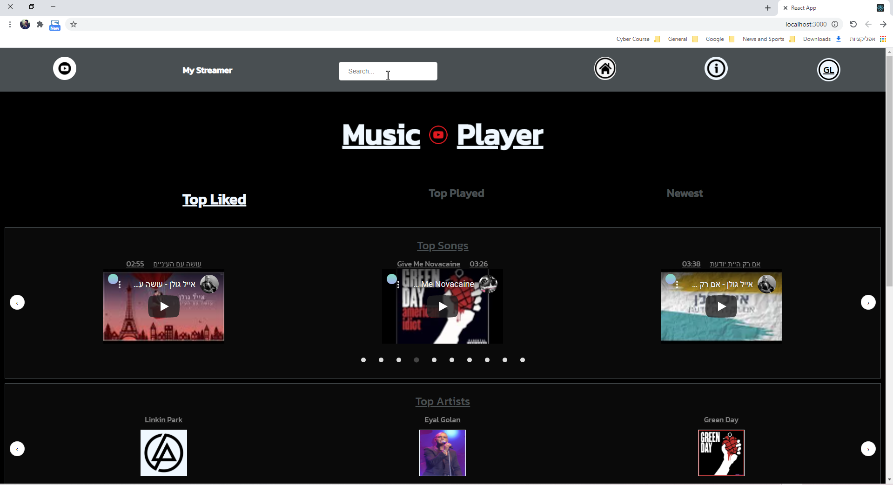
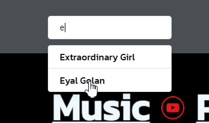
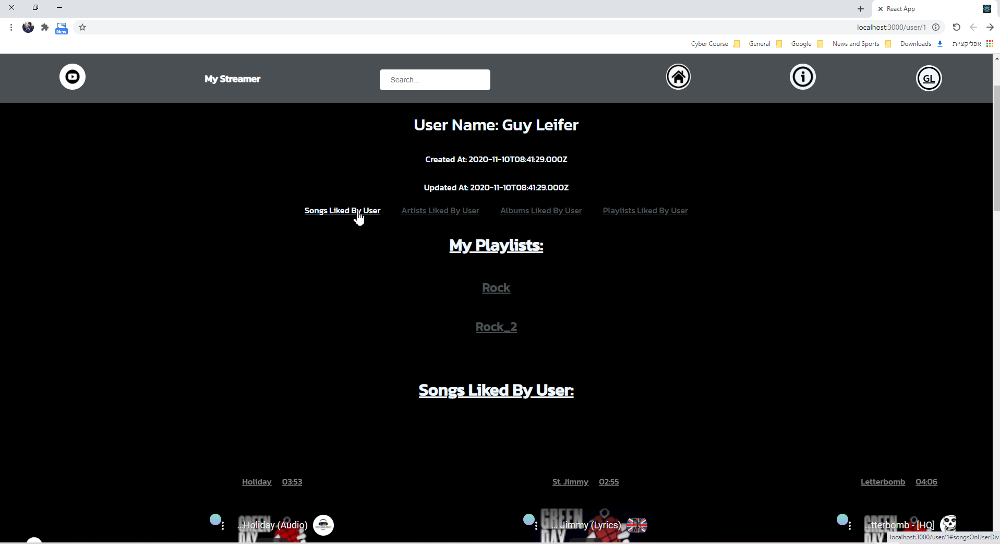
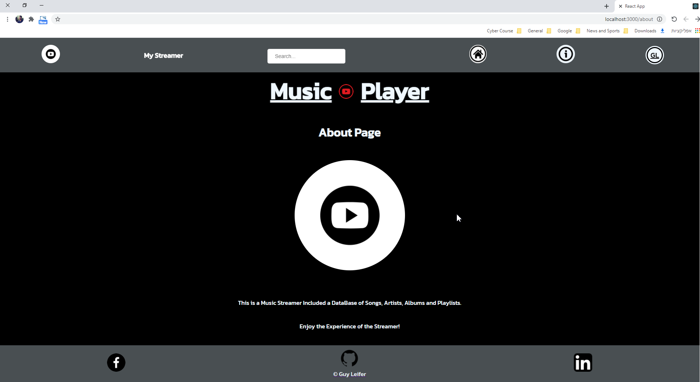

# Music Player
## Enjoy The Music Streamer Service!
    this is a repository of a music player service.
    the service offers a diversity of songs, artists, albums and playlists.
    the repository also provides user accounts for the service.
###
the repository includes database information from SQL DataBase, ("mysql2" package). 
server side with Sequelize queries and packages of authentication like: "jsonwebtoken", "sequelize", "bcrypt", "cookie-parser", to make the service safe and authorized. 
client side with usage of a lot of React packages, like: "react-router-dom", "styled-components-carousel", "react-youtube", "recoil". for perfect use of the service.
## Home Page
    the home page contains a list of of any: songs, artists, albums, playlists and a buttons to choose the selected sort of the top option you want - most liked, most played, or the newest on the service.

## Search Bar
    the service conatains a navigation bar with icons links to the service offers. one of the attributes of the navigation bar is the search bar, which can sort all the data in the service by name.

## Users
    the service offers a not required user account to control the playlist service, if you choose not use the user account you will successfully access to the service, but you can only use what inside it, and you will not have access to users pilot, like "create a playlist" or like a song, artist, album or playlist.

## About
    This is a Music Streamer Included a DataBase of Songs, Artists, Albums and Playlists.
    Enjoy the Experience of the Streamer!
